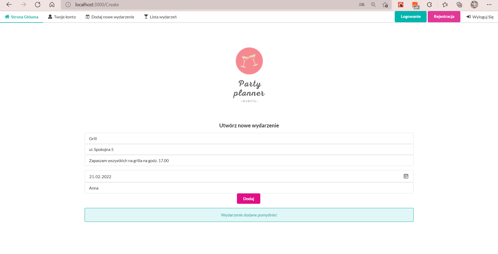
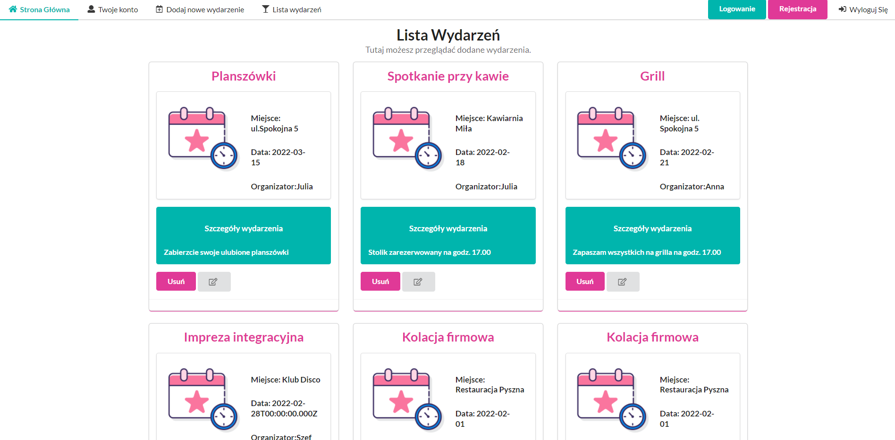
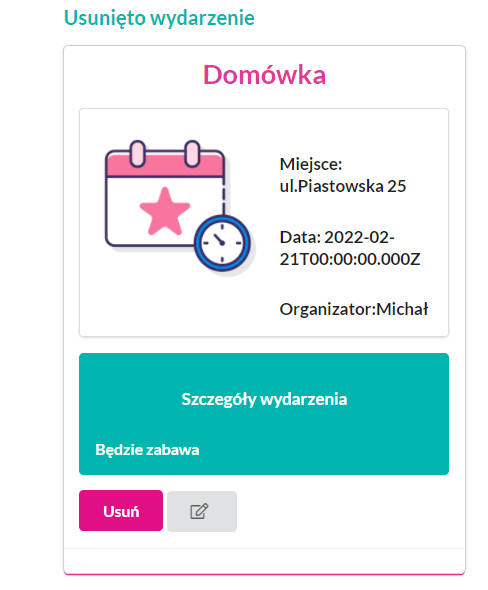
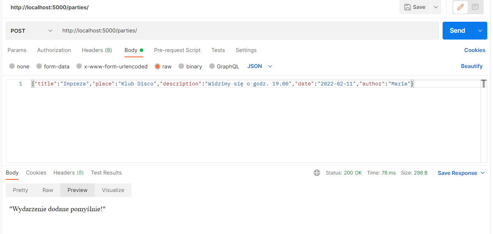
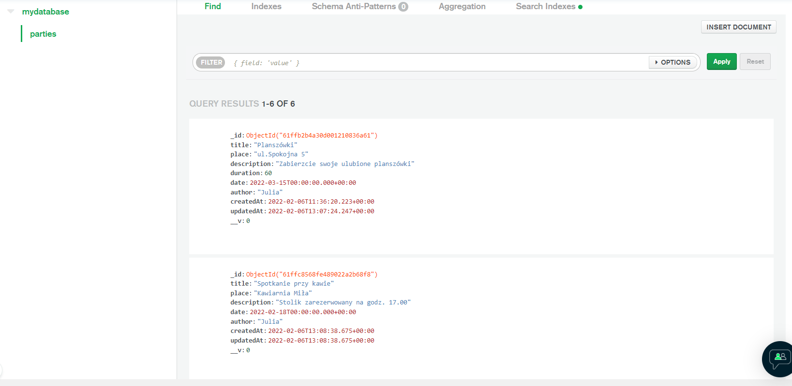
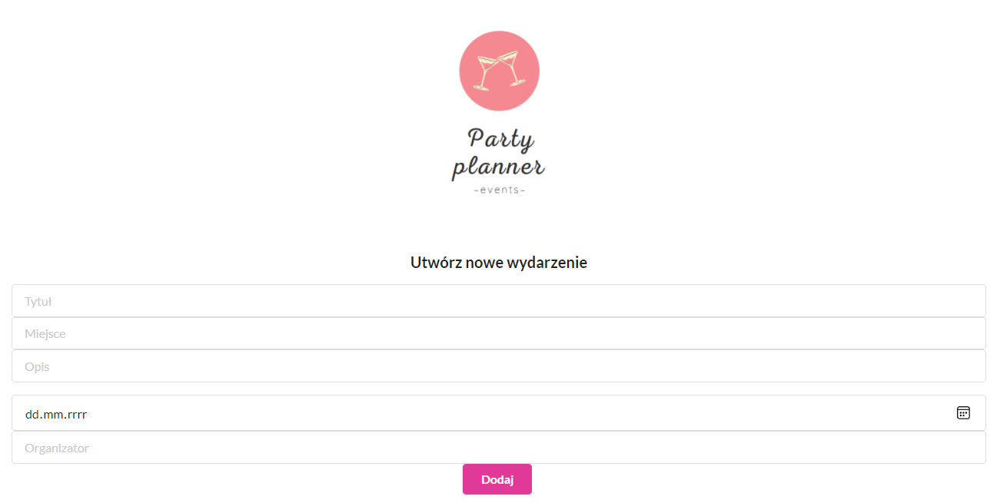
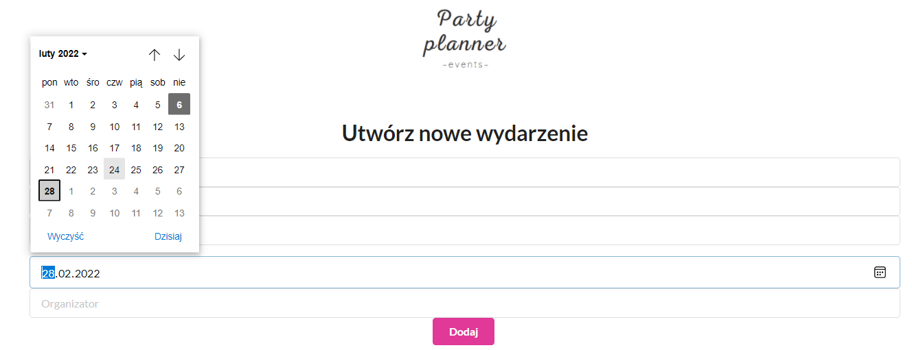

# PartyPlanner - frontend
Backend link :
[a link](https://github.com/julia741/partyplanner---backend)
* [General info](#general_info)
* [Technologies](#technologies)

## General info
PartyPlanner pozwala na dodawanie, usuwanie, aktualizowanie i wyświetlanie listy wydarzeń.
Screenshoty :
### Dodawanie wydarzenia

### Lista wydarzeń

## Usuwanie wydarzenia

## Postman

## MongoDB

## inne
 
  
## Technologies
Projekt został stworzony z użyciem tych technologii:
* Node.js
* React
* MongoDB
* Semantic-UI

